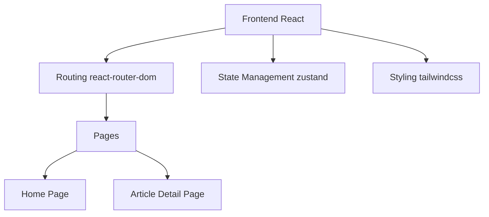

## 1. Architecture Design



## 2. Technology Description
- Frontend: React@18 + TypeScript + tailwindcss@3 + vite
- Initialization Tool: vite-init
- Backend: None (前端静态数据)
- Database: None (使用本地数据)

## 3. Route Definitions
| Route | Purpose |
|-------|---------|
| / | 首页 - 文章列表 |
| /article/:id | 文章详情页 |

## 4. Data Model

### 4.1 文章数据结构
```typescript
interface Article {
  id: string;
  title: string;
  summary: string;
  content: string;
  coverImage: string;
  publishDate: string;
  readTime: string;
}
```

### 4.2 示例数据
```typescript
const articles: Article[] = [
  {
    id: '1',
    title: '我的第一篇文章',
    summary: '这是我的第一篇个人文章，分享一些想法和感悟...',
    content: '这里是完整的文章内容...',
    coverImage: 'https://trae-api-cn.mchost.guru/api/ide/v1/text_to_image?prompt=minimalist%20writing%20desk%20with%20laptop%20and%20coffee%20cup&image_size=square_hd',
    publishDate: '2024-05-15',
    readTime: '5 分钟阅读'
  }
];
```
