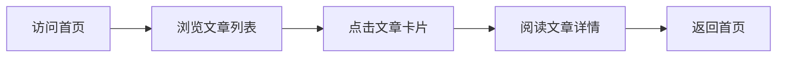

## 1. Product Overview
个人文章博客网站，用于展示和分享个人撰写的文章作品。
- 主要用途：发布、展示和阅读个人文章
- 目标用户：文章作者和普通读者

## 2. Core Features

### 2.1 Feature Module
1. **首页**：英雄区、导航栏、文章列表展示
2. **文章详情页**：文章内容展示、返回按钮

### 2.3 Page Details
| Page Name | Module Name | Feature description |
|-----------|-------------|---------------------|
| 首页 | 英雄区 | 网站标题、简短介绍、欢迎文字 |
| 首页 | 导航栏 | 网站logo、导航链接 |
| 首页 | 文章列表 | 文章卡片展示，包含封面图、标题、摘要、发布日期 |
| 文章详情页 | 文章内容 | 完整文章展示，支持滚动阅读 |
| 文章详情页 | 返回导航 | 快速返回首页的按钮 |

## 3. Core Process
用户访问首页 → 浏览文章列表 → 点击文章卡片 → 阅读文章详情 → 返回首页继续浏览

## 4. User Interface Design
### 4.1 Design Style
- 主色调：深蓝色 (#1e3a5f) 和白色
- 辅助色：浅灰色 (#f5f7fa)、中灰色 (#6c757d)
- 按钮风格：圆角设计，悬停有轻微阴影
- 字体：系统无衬线字体，标题使用较大字号，正文清晰易读
- 布局风格：卡片式布局，顶部导航
- 整体风格：简洁、优雅、专业

### 4.2 Page Design Overview
| Page Name | Module Name | UI Elements |
|-----------|-------------|-------------|
| 首页 | 英雄区 | 渐变背景、居中布局、大标题、副标题、流畅动画 |
| 首页 | 文章列表 | 响应式网格布局、卡片悬停效果、图片占位 |
| 文章详情页 | 文章内容 | 干净的阅读区域、适当的行高、清晰的标题层级 |

### 4.3 Responsiveness
桌面优先设计，自适应平板和移动设备，保证在各种屏幕尺寸下的良好阅读体验。
